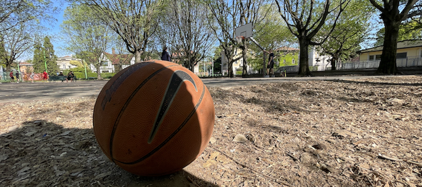
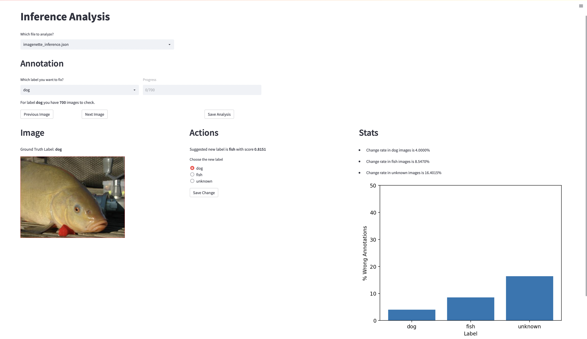
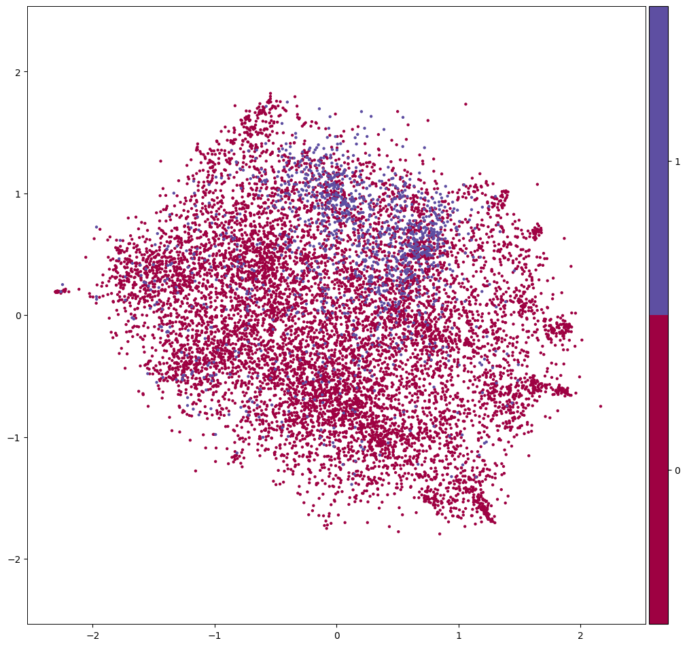

<p align="center">
    
</p>

# **classifier-playground**
Playground for image classification models, techniques, etc.. (with cuda and MPS support)

## **Train**

You can train your own classifier with your own dataset (image folder dataset) with the script *train.py*.

Please have a look at the *config/config.yml* file to setup your training (e.g. timm model, batch size, transformation set, etc.)

```
python train.py \
    --data-dir PATH/TO/YOUR/TRAIN/DATASET \
    --config config/config.yml \
    --output-dir PATH/TO/YOUR/OUTPUT/DIR  
```

## **Inference**

The script *inference.py* is an entry point to predict labels on your dataset. 

```
python inference.py \
    --data-dir PATH/TO/YOUR/DATASET \
    --model-dir PATH/TO/TRAIN/OUTPUT/DIR \
    --config CONFIG/NAME/IN/TRAIN/OUTPUT/DIR.yml \
    --ckpt CHECKPOINT/FILE/IN/OUTPUT/DIR.ckpt \
    --batch-size 128 \
    --split [true|false] \
    --output OUTPUT/WITH/PREDICTION/FILENAME.json
```
[:warning: WARNING]

If *--split* is set to *false*, it means that the dataset is not split into classes' folder. In this case, the inference script will run only if *--data-dir* is a folder with just images in it.

## **Misclassified Analysis**

With the result of the inference script you can visualize predictions and then the misclassified ones with **[streamlit](https://streamlit.io)**. 

The webapp expects a json file slightly different from the one produced by the inference script. Here the structure to respect:

```
{
    "class_a: [
        {
            "file_path": "ABSOLUTE/PATH/TO/IMG_1.jpg",
            "ground_truth": "class_a",
            "prediction": "class_b",
            "score": 0.515
        },
        {
            "file_path": "ABSOLUTE/PATH/TO/IMG_12.jpg",
            "ground_truth": "class_a",
            "prediction": "class_a",
            "score": 0.995
        },
        ...
    ],
    "class_b": [
        {
            "file_path": "ABSOLUTE/PATH/TO/IMG_100.jpg",
            "ground_truth": "class_b",
            "prediction": "class_b",
            "score": 0.915
        },
        {
            "file_path": "ABSOLUTE/PATH/TO/IMG_102.jpg",
            "ground_truth": "class_b",
            "prediction": "class_b",
            "score": 0.725
        },
    ],
    ...
}
```
After the json file is ready, place it under *streamlit/data* folder and run the *visualize_inference.py* script within *streamlit* folder.
```
streamlit run visualize_inference.py
```

If you find something wrong in your dataset, you can change the label accordingly within the webapp and save the result.

<p align="center">
    
</p>

## **Domain Shift Estimation**

Implementation of [Measuring Domain Shift for Deep Learning in Histopathology](https://www.diva-portal.org/smash/get/diva2:1478702/FULLTEXT02.pdf) to estimate the representation shift (with Wasserstein distance) for a new dataset for a model trained another dataset.

To do so, just use the notebook **notebooks/domain-shift-estimation.ipynb**.

Embedding plot in 2D is made with [pymde](https://pymde.org), which is the best one to represents embeddings with high-dim in 2D since it preserves distances between embeds while reducing their dim.

<p align="center">
    
</p>


